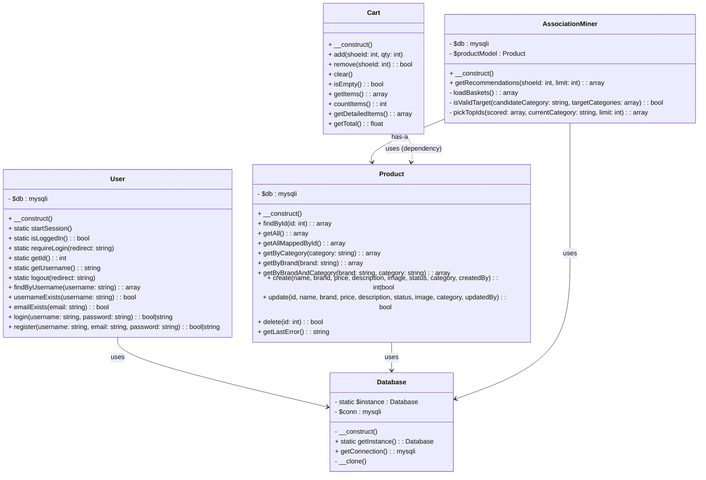

# Myshoes Class Diagram

Below is the UML Class Diagram for the PHP classes found in `Myshoes/classes/`. You can view this diagram using any Markdown viewer that supports Mermaid syntax (like GitHub or modern IDE plugins).

