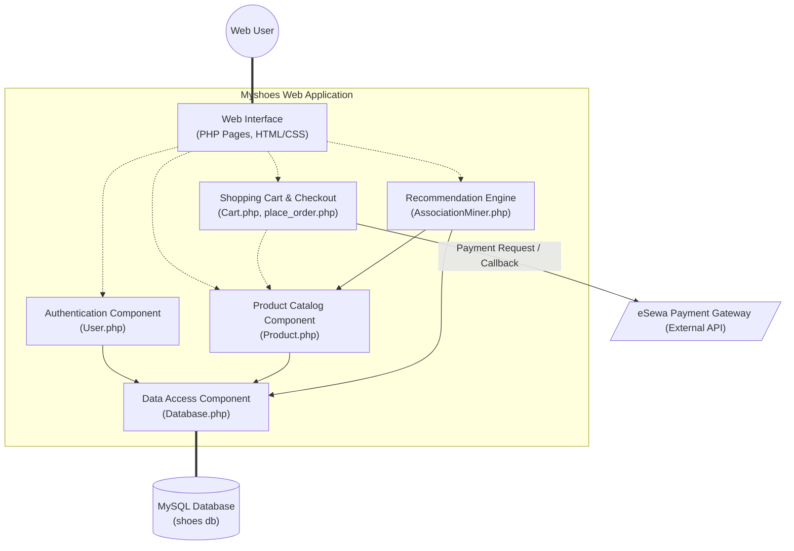

# Myshoes Component Diagram

Below is the UML Component Diagram mapping the high-level architecture and the dependencies between various modules of the Myshoes system, including the external eSewa payment integration. You can view this diagram using a Markdown viewer that supports Mermaid syntax.

