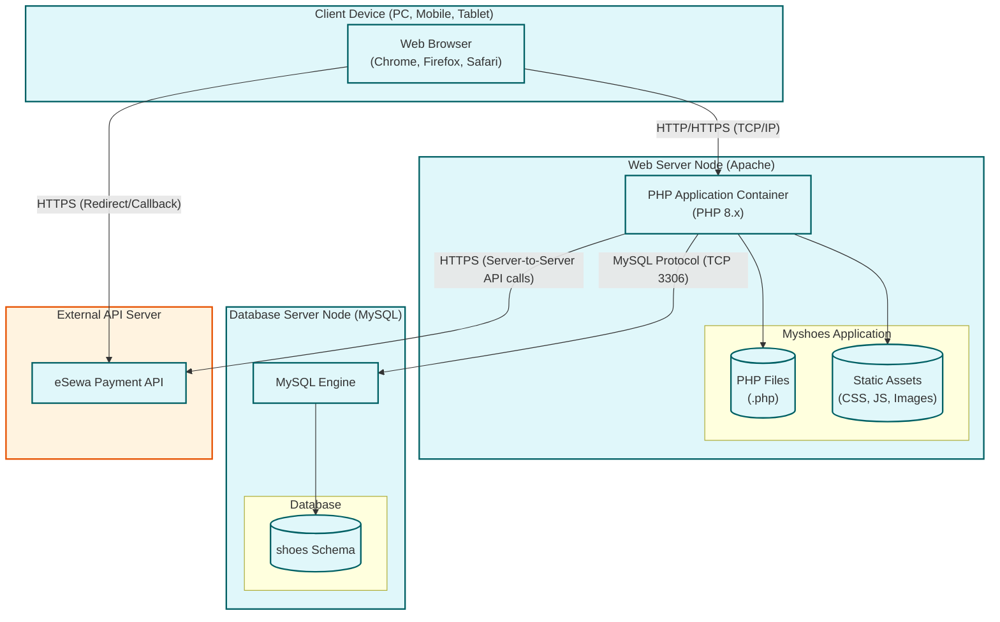

# Myshoes Deployment Diagram

Below is the UML Deployment Diagram illustrating the physical hardware and software environment where the Myshoes system is deployed (e.g., typically a LAMP/XAMPP stack). You can view this diagram using a Markdown viewer that supports Mermaid syntax.

