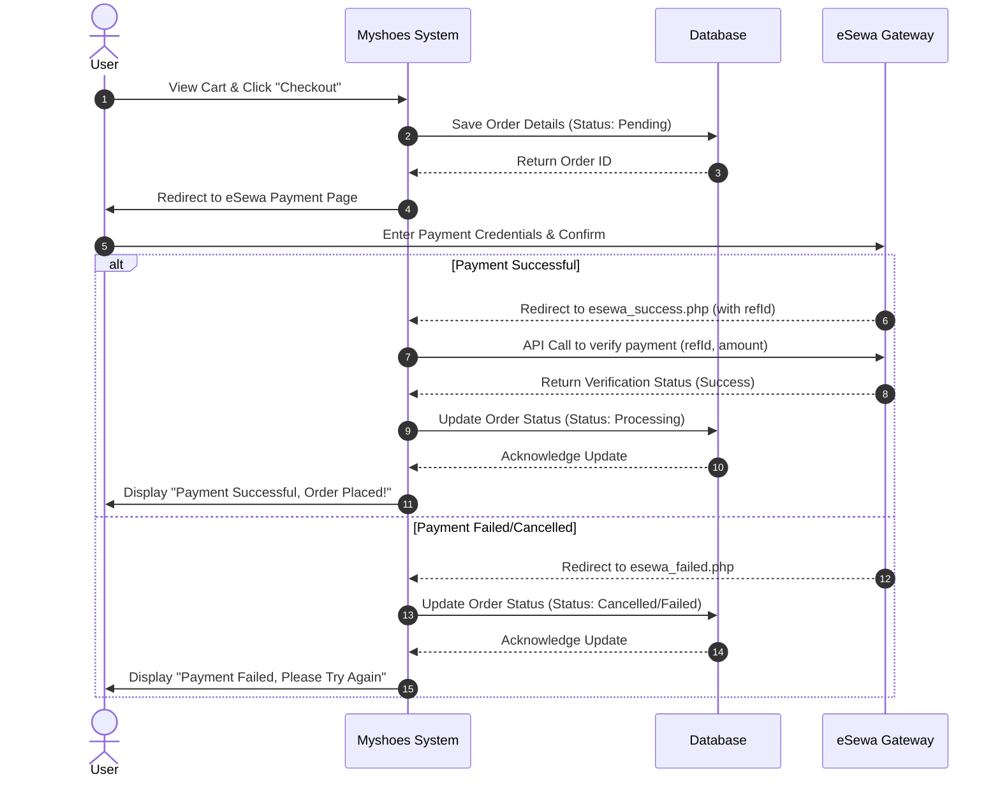

# Myshoes eSewa Checkout Sequence Diagram

Below is the UML Sequence Diagram illustrating the interactions between the User, the Myshoes System, the eSewa Payment Gateway, and the Database during the checkout process. You can view this diagram using a Markdown viewer that supports Mermaid syntax.

