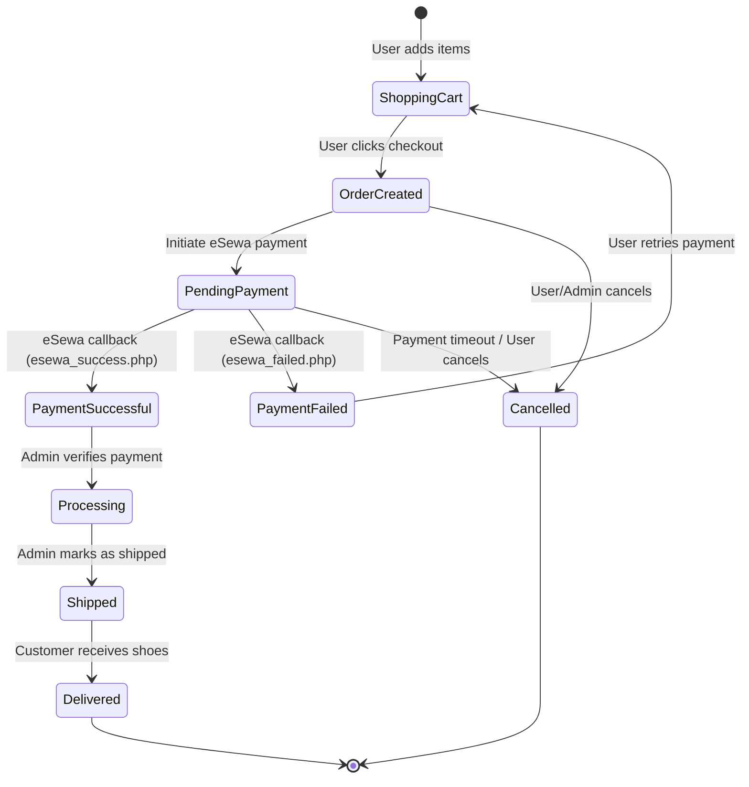

# Myshoes Order Lifecycle State Diagram

Below is the UML State Diagram mapping the lifecycle of an Order in your e-commerce system, specifically focusing on the eSewa payment integration flow. You can view this diagram using a Markdown viewer that supports Mermaid syntax.

