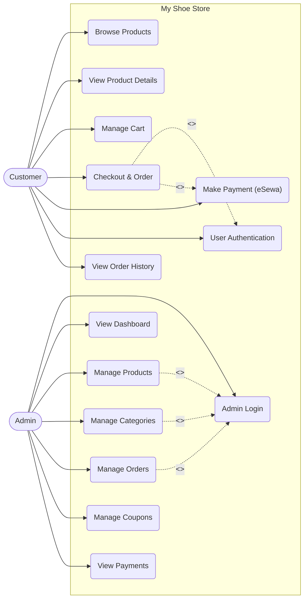

# Use Case Diagram

```mermaid
flowchart LR
    %% Actors
    Customer(["Customer"])
    Admin(["Admin"])

    %% System Boundary
    subgraph My Shoe Store
        UC1("Browse Products")
        UC2("View Product Details")
        UC3("Manage Cart")
        UC4("Checkout & Order")
        UC5("Make Payment (eSewa)")
        UC6("User Authentication")
        UC7("View Order History")
        
        UC8("Admin Login")
        UC9("View Dashboard")
        UC10("Manage Products")
        UC11("Manage Categories")
        UC12("Manage Orders")
        UC13("Manage Coupons")
        UC14("View Payments")
    end

    %% Customer Relationships
    Customer --> UC1
    Customer --> UC2
    Customer --> UC3
    Customer --> UC4
    Customer --> UC5
    Customer --> UC6
    Customer --> UC7

    %% Admin Relationships
    Admin --> UC8
    Admin --> UC9
    Admin --> UC10
    Admin --> UC11
    Admin --> UC12
    Admin --> UC13
    Admin --> UC14
    
    %% Includes
    UC4 -. "<<includes>>" .-> UC6
    UC4 -. "<<includes>>" .-> UC5
    
    UC10 -. "<<includes>>" .-> UC8
    UC11 -. "<<includes>>" .-> UC8
    UC12 -. "<<includes>>" .-> UC8
```
